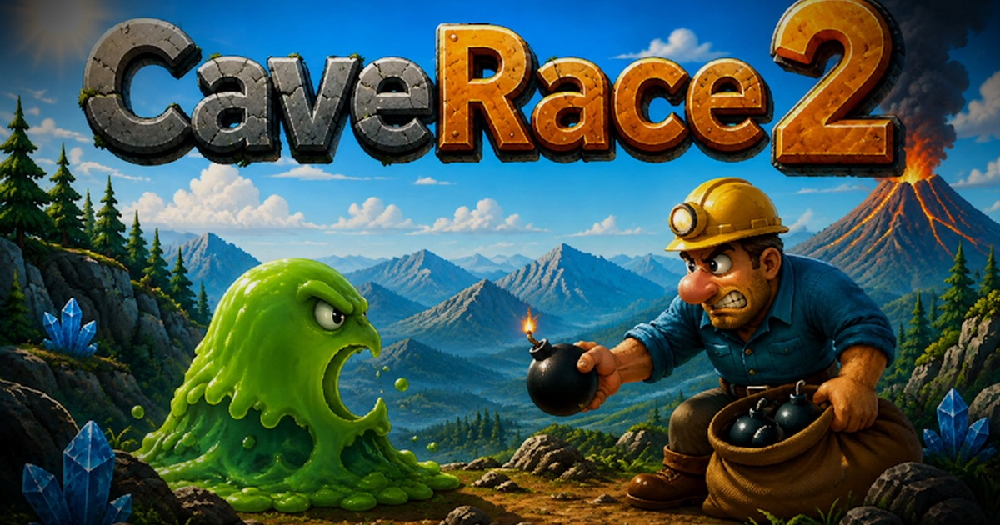

  

# NavaTron Game Studios

We are an independent game studio from the Netherlands, creating games with a classic spirit and modern craftsmanship. NavaTron Game Studios is part of **NavaTron B.V.**

## CaveRace 2 is now available

Explore 25 handcrafted caves across Forest, Desert, Winter, and Lava. Hunt for treasure, outsmart hostile creatures, and use carefully placed bombs to open a path to safety.

- Single-player cave-action adventure for Windows and macOS
- Fully offline, with no accounts, ads, analytics, or in-app purchases
- Keyboard, mouse, and controller support

**[Discover CaveRace 2](https://caverace.com/2/)** · **[Microsoft Store](https://apps.microsoft.com/detail/9P77CN5KM90Q)** · **[Mac App Store](https://apps.apple.com/us/app/caverace-2/id6800011978)**

Follow development, trailers, and game updates on **[YouTube](https://www.youtube.com/@NavaTronGameStudios)**.

---

CaveRace began in 1997 and continues today at NavaTron Game Studios. Copyright © 1997–2026 NavaTron B.V.
